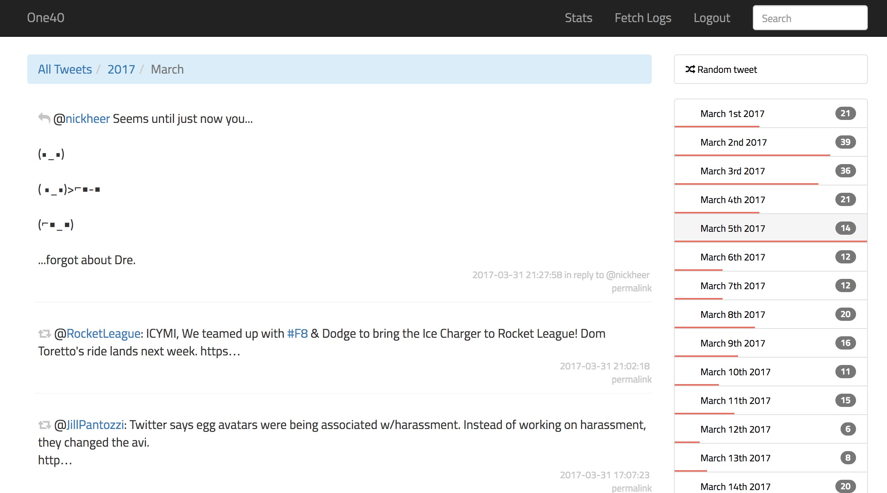

# One40 — Self Hosted Twitter Archive

A personal, searchable Twitter archive built with Laravel.

[Live Demo](http://tweets.rbbl.ws)

## Requirements

- See the [Laravel requirements](https://laravel.com/docs/5.4#server-requirements)
- A twitter account

## Inital Setup

- Clone this repository `git clone https://github.com/rmlewisuk/one40.git one40`
- Navigate to the root `cd one40`. 
- Run `composer install`
- Create a copy of the example env file `cp .env.example .env`. 
- Open `.env`, fill in your database details. 
- Go to [https://apps.twitter.com](https://apps.twitter.com) and create a new application to get your app keys, and put them in the env file. Note: set `PRIVATE` to true if you don't want your Twitter archive to be publicly accessible (we'll create a user account in the next step). 
- Finally, run `php artisan key:generate`.

## User account

Run `php artisan one40:setup`; this will setup the database and prompt for a username and password. This user account is used to login to one40 to see fetch logs and limit access to your archive (if the app is set to private).

## Importing your archive

NB: You can request your [Twitter archive here](https://support.twitter.com/articles/20170160)

To import your archive, move all the `(data/js/tweets/year_month.js)` files to `resources/archive` (create the `archive` directory if it doesn't exist) and run `php artisan one40:import`. This can take a while depending on the size of your archive, so if it times out, just rerun it — one40 keeps track of which files it has imported, so it won't re-run the same archive file twice.

## Fetching new tweets

You can fetch new tweets by running `php artisan one40:fetch`. This will import your most recent tweets (up to 3200) so it's best to import a recent archive first. It's recommended you setup a cron job to fetch new tweets on a schedule (although you can do it manually if you want). To fetch new tweets at midday every day, add this to your crontab:

`1 12 * * * php /path/to/your/project/artisan one40:fetch`

[This article](https://www.digitalocean.com/community/tutorials/how-to-use-cron-to-automate-tasks-on-a-vps) explains how to setup cron jobs.

## Licence

Signifcant portions of the tweet importing logic is from [Tweetnest](https://github.com/graulund/tweetnest/blob/master/LICENSE.txt) licenced under MIT.

[http://rmlewisuk.mit-license.org/](http://rmlewisuk.mit-license.org/)